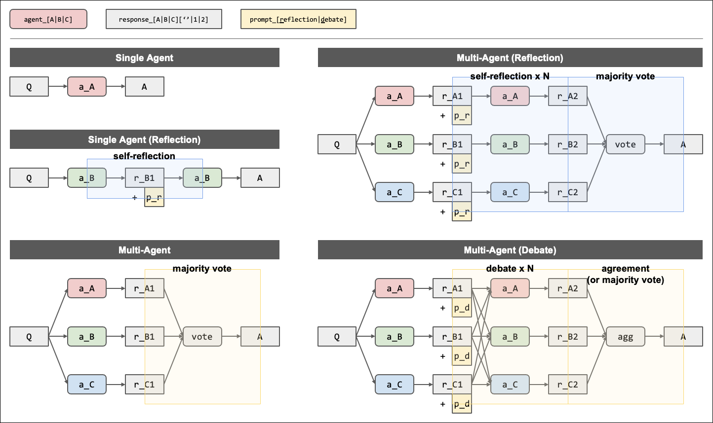
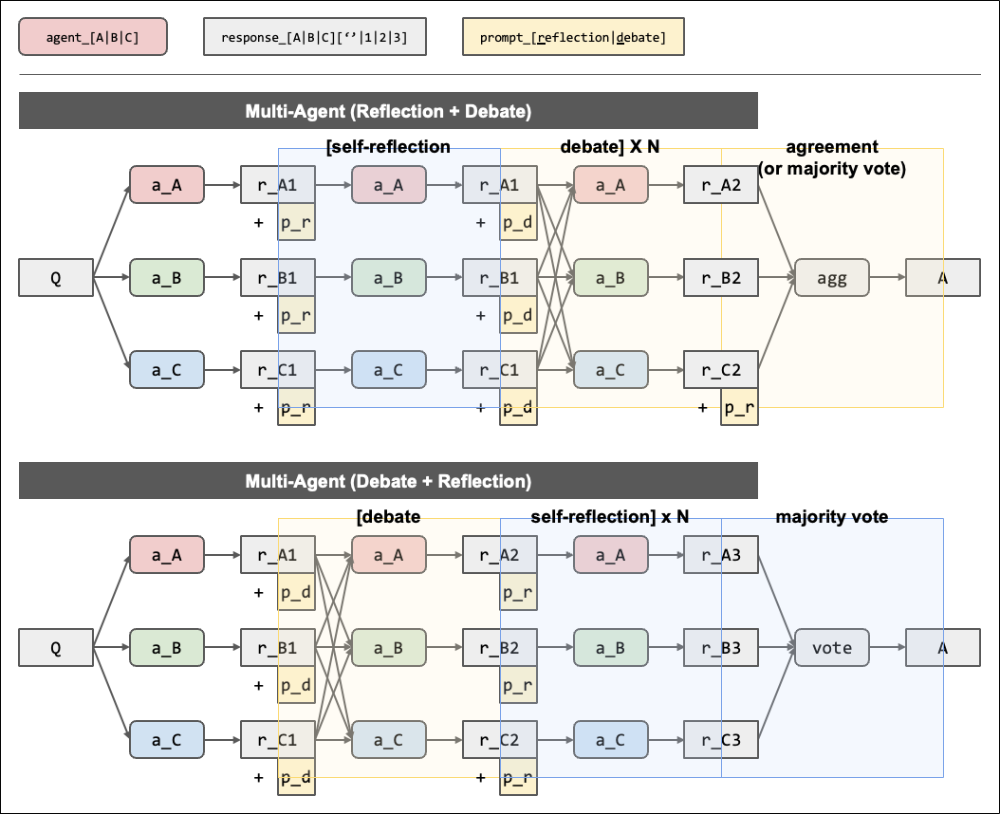

# LLM Debate

### KAIST AI 601 (Spring 2024)

- Team: Eunji Ko, Geewook Kim, Jiho Choi
  - { `kosu7071`, `geewook`, `jihochoi` } @ kaist.ac.kr
- Toy Experiments for `Arithmetic` Task in Multi-agent Debate
  - `Improving Factuality and Reasoning in Language Models through Multiagent Debate (arXiv 2023)`
- Presentation ([Slides](https://docs.google.com/presentation/d/1tWZ1p7CoUQHy9WHCUB2MurMLuv9dt_N0yKWSBAmc-5g/edit?usp=sharing))

### Overview

| Single Agent vs. Multi-agent | Reflection → Debate vs. Debate → Reflection|
| :---: | :---: |
|  |   |

<!-- |      Single Agent vs. Multi-agent      |
| :------------------------------------: |
|  |

| Reflection → Debate vs. Debate → Reflection |
| :-----------------------------------------: |
|       | -->

### Usage

```bash
cd .
python3 ./src/math_debate.py
```

### Project Structure

```markdown
.
├── README.md
├── results
│   └── .
├── env
│   └── key.txt
└── src
    ├── math_debate.py
    └── utils.py
```

### Setup

##### Setup OpenAI Key

```bash
# [inside] ./env/key.txt
OPENAI_API_KEY=sk-proj-xxxxxxxx
```

##### Setup Environments

```bash
# conda deactivate
# conda env list
# du -sh ~/miniconda3/envs/*
# conda remove --name openai --all
# conda create --name openai python=3.12 -y
conda create --name openai -y
conda activate openai

# pip install -r requirements.txt
# conda install pip -y
pip3 install numpy
pip3 install openai==0.28
pip3 install tqdm
```

### References

- [OpenAI API Docs](https://platform.openai.com/docs/api-reference/chat/create?lang=python)
  - [Create chat completion](https://platform.openai.com/docs/api-reference/chat/create)
  - [Create assistant (beta)](https://platform.openai.com/docs/api-reference/assistants/createAssistant)
- Improving Factuality and Reasoning in Language Models through Multiagent Debate ([OpenReview 2023.09](https://openreview.net/forum?id=QAwaaLJNCk))
  - GitHub: [`composable-models/llm_multiagent_debate`](https://github.com/composable-models/llm_multiagent_debate/tree/main)
- Reflexion: Language Agents with Verbal Reinforcement Learning ([NeurIPS 2024](https://neurips.cc/virtual/2023/poster/70114))
  - GitHub: [`noahshinn/reflexion`](https://github.com/noahshinn/reflexion)

### Future Work

- attention on agents
